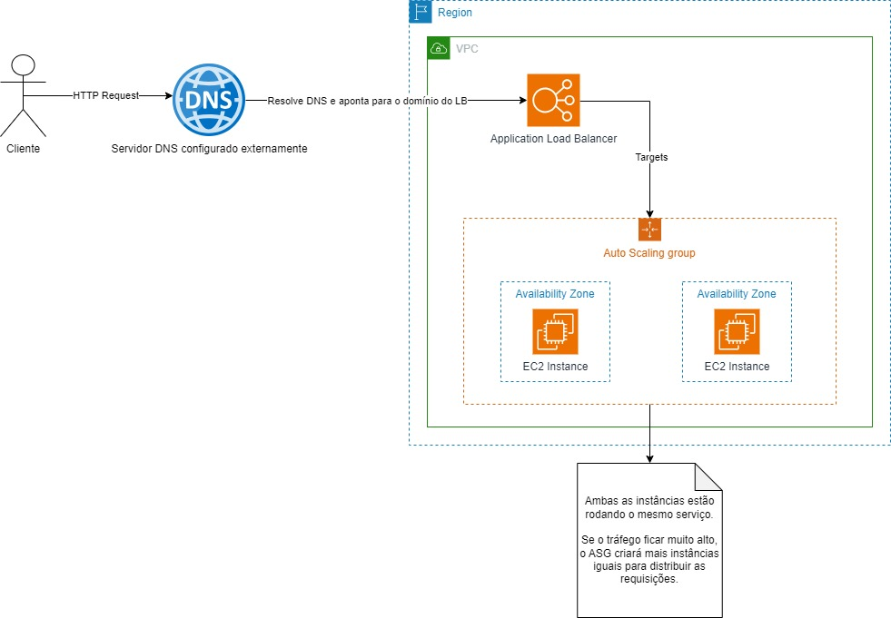

# Amazon EC2
Serviço que provê máquinas virtuais da AWS para sua infraestrutua em nuvem. Você poder escolher várias imagens para criar sua instância EC2, que definirá quais softwares estarão na máquina: sistemas operacionais, linguagens, bancos de dados, docker, nginx, coisas do tipo. E depois você define o poder computacional da máquina e o armazenamento.

## Security Groups
Os security groups no EC2 funcionam como uma espécie de firewall, controlando o que entra e o que sai para cada instância. Você sempre terá um sg default que é para comunicação entre instâncias da mesma VPC, como uma rede interna, mas também pode criar seus próprios SG's.

Por exemplo, um servidor web deve ter um security group para que qualquer máquina possa acessar as suas portas 80 e 443, que são as portas padrão para requisições HTTP/HTTPS, e também um security group para SSH, que permite a conexão entre o servidor remoto com a sua máquina local, para que você, o admin, faça a configuração desse servidor quando necessário.

Então basicamente, o security group para acesso web irá permitir entrada de qualquer IP pelas portas HTTP e a saída de qualquer coisa para qualquer IP, com qualquer protocolo de rede. E o security group irá permitir apenas a entrada de comunicação SSH vindo do IP da sua máquina, apenas, e a saída de qualquer coisa, para qualquer IP, com qualquer protocolo. Esse foi só um dos exemplos mais comuns para o uso de security groups.

## Imagens AMI
Como dito antes, existem imagens chamadas AMI para a criação de novas instâncias com softwares já configurados, você pode criar uma imagem a partir de qualquer instância que você tiver ativa no EC2, lembre sempre de criar a imagem com a máquina desligada, para que arquivos de cache e coisas desse tipo específicas daquela máquina não estarem presentes na imagem.

## Modelos
Enquanto as imagens são um template dos softwares que estarão presentes na instância EC2, os modelos são template do hardware, você define um modelo que irá ditar qua o tipo de máquina e qual o espaço de armazenamento, isso será útil para o auto-scaling que será abordado em breve.

## Elastic Load Balancer
Um load balancer tem a função de distriuir requisições igualmente para servidores diferentes rodando uma mesma aplicação. Quando um serviço tem alta demanda e recebe muitas requisições por minuto, é interessante usar o load balancer para não sobrecarregar a memória e CPU do seu servidor. Com o load balancer você terá mais de um servidor rodando a mesma aplicação e as requisições serão distribuídas igualmente entre eles, para que ninguém fique sobre carregado.

O Amazon ELB, possui alguns tipos de load balancer à disposição mas o principal é o Application Load Balancer, que cuida de requisições HTTP/HTTPS. Quando você cria um ALB (Application Load Balancer), ele terá um domínio e você deve apontar um target para onde esse domínio apontará, no caso ele apontará geralmente para um **target group**.

## Target Group
Um target group é o alvo para onde o load balancer irá apontar, geralmente esse alvo é o grupo de servidores (instâncias EC2) que estão rodando nossa aplicação. Você deve criar um target group e nele inserir as instâncias para onde você quer que o load balancer envie as requisições que batem em seu DNS, melhorando a disponibilidade e desempenho do web service.

Ou, você pode colocar dentro do target group, um **grupo de auto scaling**. Explicarei a seguir.

## Auto Scaling Group
A técnica de usar um load balancer para melhorar a disponibilidade do nosso serviço, dividindo-o em várias máquinas é muito boa, mas, quantas máquina devo usar? Sabemos que, um serviço da web tem picos de acesso que dependem do horário, dia da semana e até época do ano, por exemplo, uma e-commerce de brinquedos com certeza terá muito mais acessos no mês das crianças ou no natal do que em outras épocas do ano. E como recursos de computação em nuvem são caros, seria bom ter uma forma de aumentar o número de servidores e diminuir conforme a **demanda**. Para que tenhamos alta disponibilidade quando houverem muitos acessos, e mais baixa disponibilidade em horários de poucos acessos, como de madrugada.

É para isso que serve o Auto Scaling! Ele faz a gestão de instâncias do EC2, criando novas instâncias e destruindo-as, conforme demanda! Tudo o que você deve fazer é criar um auto scaling group, e é aí que você deve ter o modelo, para definir qual o hardware de casa instância, todas elas devem ser iguais. E então você configura as políticas de auto scaling, por exemplo: meu auto scaling group deve ter sempre no mínimo 2 instâncias EC2 rodando a aplicação, e no máximo 4, sendo o número ideal 2. Sempre que a CPU delas chegarem a 50%, uma nova instância deve ser criada, até chegar no número máximo, 4. Isso é apenas um exemplo mas você pode definir a política que quiser.

Existem políticas de auto scaling dinâmicas e preditivas, as preditivas irão usar seu histórico de consumo, caso você não tenha um, é melhor ir com a dinâmica, onde você define as métricas manualmente.

Depois de tudo isso é só definir que o target do load balancer será o seu auto scaling group, invés de um grupo fixo de máquinas. Dessa forma você terá, ao mesmo tempo, provisionamento automático de servidores e balanceamento da carga entre estes servidores, não é o máximo?

## Resumo do Fluxo
Segue um desenho que demonstra o resumo do funcionamento desse fluxo todo:

Basicamente, o cliente chama um DNS, que aponta pro load balancer, que terá um alvo, que é o auto scaling group, que possui geralmente algumas máquinas e irá criando e destruindo mais máquinas conforme intensidade de tráfego. Para este exemplo, usei um DNS externo e pedi para ele apontar para o nosso load balancer, mas tem como fazer tudo isso dentro da AWS com o serviço Route 53 que cuida de DNS também.