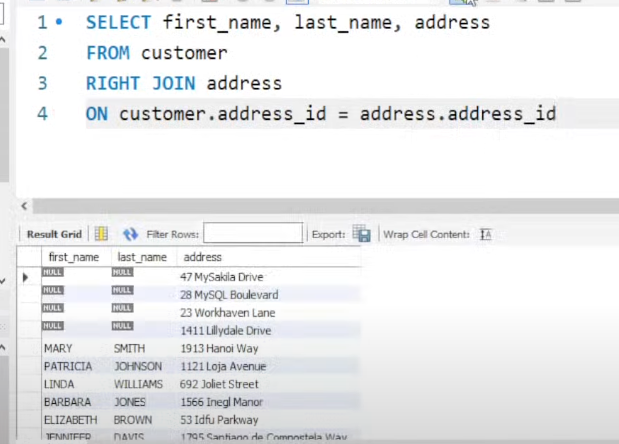

# Joins
## Inner Join
A grosso modo, o JOIN é necessário quando queremos fazer um select puxando
dados de uma tabela X e junto com isso, alguns dados que pertencem à colunas
de outras tabelas que se relacionam com a X, fazendo a conexão via chaves estrangeiras.
Por exemplo, tenho a tabela cliente com várias colunas e a tabela endereço que está
relacionada com os clientes. Se eu quiser fazer um select que retorne o nome do
cliente e a rua que ele mora, é uma situação onde posso fazer um JOIN, pois
na tabela cliente só temos o dado id_endereco, que é uma chave foreign. Como fazer:
```sql
SELECT name, street
FROM customer
JOIN address
ON customer.address_id = address.address_id;
```
Este JOIN padrão está chamando, por baixo dos panos, o comando INNER JOIN, esse tipo de join é o join que
procura matches nas duas tabelas que são especificadas, ou seja, dados de nome de cliente que estejam
de fato ligados a alguma rua de endereço.

## Left e Right Join
Temos, também, o left e right join, que funcionam da seguinte forma:
* Left: Busca por registros cuja existe um dado na tabela da esquerda, ou seja, a primeira a ser chamada, que no caso aqui é customer, mas pode ou não existir algo na da direita, que no caso é a de endereços. Ou seja, não precisa ser um match perfeito onde nos dois lados existe algum dado, apenas o lado esquerdo precisa de dados.
* Right: Já no right, é ao contrário. Os dados da tabela endereço que precisam estar populados, mas podem vir dados nulos do lado esquerdo, um exemplo pra entender melhor é no caso por exemplo de existirem alguns endereços cadastrados porém sem estarem ligados a nenhum cliente específico, porque talvez o cliente dono desse endereço pode ter sido excluído da base, por exemplo. Isso geraria uma view mais ou menos assim:
<br><br>
No case dessa imagem, ao fazer a mesma query com o LEFT JOIN poderia rolar um cenário onde todos esses registros com valores nulos desaparecem. Pois não há nenhum cliente que não tenha endereço cadastrado, entendeu?

## Ambiguidade
Às vezes, duas tabelas podem ter colunas com nomes iguais, para evitar confusões na hora de escrever queries, chame uma coluna junto com o nome da tabela para evitar problemas:
```sql
select customer.first_name, manager.first_name
...
```
Você quer o primeiro nome de um cliente e talvez o primeiro nome do gerente da loja que ele frequenta em uma mesma query, por exemplo. Essa é a melhor forma de evitar confusões.

## Outer Join
Basicamente uma união do left e do right joint, não vem por padrão em alguns SGBDs como MySQL. Vai trazer todos os registros, sendo permitido dados nulos em ambos os lados (clientes sem rua, ruas sem cliente).

## Rascunho: Queries úteis
```sql
-- SELECT com multiplos joins em um contexto de tabela pivo,
-- usando aliases e comando using ao invés de on
select f.title, c.name, l.name, a.first_name, a.last_name
from film as f
    join film_category as fc using(film_id)
    join category as c using(category_id)
    join language as l using(language_id)
    join film_actor as fa using(film_id)
    join actor as a using(actor_id)
where a.last_name like "CRUISE";

-- Query para retornar o numero de filmes registrados por categoria
-- utilizando comandos como count e group by
select c.name, count(c.name) as quantidade
from film as f
         join film_category as fc using(film_id)
         join category as c using(category_id)
group by c.name;

-- Outra query para retornar o numero de cidades por país, utilizando
-- o comando order by para escolher uma ordenacao padrao asc ou desc
select c.country, count(city) as quantidade_de_cidades
from city
    join country as c using(country_id)
group by c.country
order by quantidade_de_cidades desc;
```